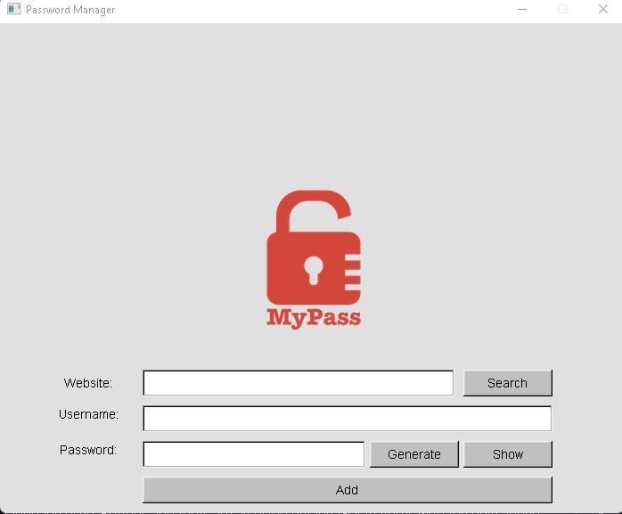

## What is this repo?  
This repo consist of a password manager tool that has beend eveloped in a variety of different languages. Each project is organized by the programming language used. Buttons and fonts are all using default GUI features with the only added asset being the lock image. Each project has the ability to add an entry to a database, search for information based on website, hide and show password text and a built in password generator.

## What is this repo for?  
This repo exists for two main purposes.

1. Provide the ability to view how a language works and provide a fair direct comparison between two or more languages. This is one of the most fair comparisons you can have when looking at syntax and a language's workings due to them all creating the same application.

2. Allow someone who may be new(er) to programming and potentially looking to learn another language to view some of their options. With this they can choose a starter language that gives them the least intimidation. On the other hand, if someone is used to say python, and want to move to something with better performance. They have the option of directly comparing the python code they are used to using with the more performant language they want to learn, such as C++.
    

## GDScript  

  

## Python  

  

## C++  

  

## C++ with AGK headers (AGK Tier 2) 

  

## AGK Tier 1  

  

## Dart  

  

## CSharp  

  

## Unreal BP  

  

## Rust  

  